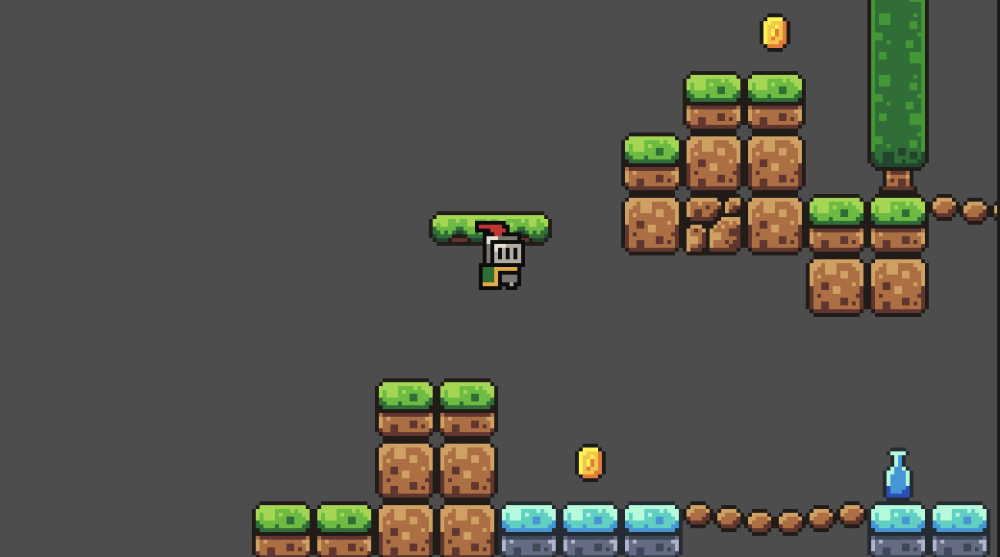

# Godot 2D Game Prototype

## Overview
This is an unfinished 2D game prototype built using the Godot engine. It demonstrates basic gameplay systems including player movement, collisions, collectibles, and level resetting.

---

## Features
- Player movement
- Kill zones (death system)
- Coin collection
- Scene reset on death

---

## Scripts
- player.gd
- killzone.gd
- coin.gd

---

## Status
Work in progress project created for learning game development and portfolio purposes.

---

## How to Run
Open the project in Godot and run the main scene.

## Gameplay Screenshot

